# Best places to setup Chinese Restaurants in New York

## Table of Contents

1. [Introduction](#1-introduction)

    1. [Background](#11-background)

    2. [Problem](#12-problem)

    3. [Interest](#13-interest)

2. [Data](#2-data)

    1. [Data Sources](#21-data-sources)

    2. [Data Cleaning](#22-data-cleaning)

    3. [Feature Selection](#23-feature-selection)

3. [Predictive Modeling](#3-predictive-modeling)

    1. [Classification Models](#31-classification-models)
        1. [K Nearest Neighbors](#311-k-nearest-neighbors)
        2. [Decision Tree](#312-decision-tree)
        3. [Support Vector Machine](#313-support-vector-machine-svm)
        4. [Logistic Regression](#314-logistic-regression)

    2. [Model Evaluation](#32-model-evaluation)

    3. [Model Application](#33-model-application)
        1. [Data for finding best locations](#331-data-for-finding-best-locations)
        2. [Visualizing Results](#332-visualizing-results)

4. [Conclusion](#4-conclusion)

5. [Future Work](#5-future-work)

## 1. Introduction

### 1.1 Background
In 2018, according to the International Monetary Fund, China's economy produced $25.3 trillion. This figure is based on the purchasing power parity which takes into account the effect of exchange rates, making it the best method for comparing gross domestic product by country.

This makes China the world's largest economy, seconded by the EU with $22 trillion and the United States third, producing $20.5 trillion.

Moreover, in terms of demographics in the United States, the population of Chinese immigrants have grown nearly seven-fold since 1980, reaching almost  2.5 million in 2018 (5.5 percent of the overall foreign-born population) [[source]]([https://www.migrationpolicy.org/article/chinese-immigrants-united-states]). With such an astounding rate of growth of the Chinese community in the United States, it comes with no surprise that there has been an explosion in the demand of Chinese cuisines.

In this project, I will be using Machine Learning classifiers like KNN and Logistic Regression to predict, based on a venue's surrounding neighborhood, whether the location is a good place to setup a Chinese restaurant in New York.

### 1.2 Problem

Data that might contribute to determining the success of a Chinese Restaurant might include factors like its location and surrounding venues like cinemas. In this project, I will be using Machine Learning Classifiers, like KNN and Logistic Regression, to predict whether a venue in New York will be a good location for setting up a chinese restaurant.

### 1.3 Interest

Certainly, big companies that are interested in setting up Chinese restaurant chains in New York would be interested in finding out where are the best venues they should acquire. Additionally, this would benefit small business owners who are just looking to setup their own Chinese restaurant mini-business.

## 2. Data

### 2.1 Data Sources
The data for the coordinates for each neighborhood and borough in New York can be found [here](https://ibm.box.com/shared/static/fbpwbovar7lf8p5sgddm06cgipa2rxpe.json). With these coordinates, I used the [Foursquare API](https://developer.foursquare.com/docs/places-api/endpoints/)  to retrieve all Chinese Restaurants in each neighborhood in New York. Using the same API, with the method [explore](https://developer.foursquare.com/docs/venues/explore), I retrieved the  venues within 2km radius from each Chinese Restaurant. The metric used to train the Classifiers is 'Popularity' of the restaurant. However, since this was not readily available, I had to retrieve the number of 'Likes' for each restaurant using the [venues](https://developer.foursquare.com/docs/api-reference/venues/details) method in the Foursquare API.

### 2.2 Data Cleaning
The above mentioned datasets had several problems and needed to be cleansed before fitting into the classifiers.

Firstly, the New York data did not come with data for the chinese restaurants. Thus, I needed to use the foursquare api to scrape the existing chinese restaurants in each neighborhood.

Note that the data for this project is limited in the sense that the details of each venue gathered are based on foursquare's existing database.

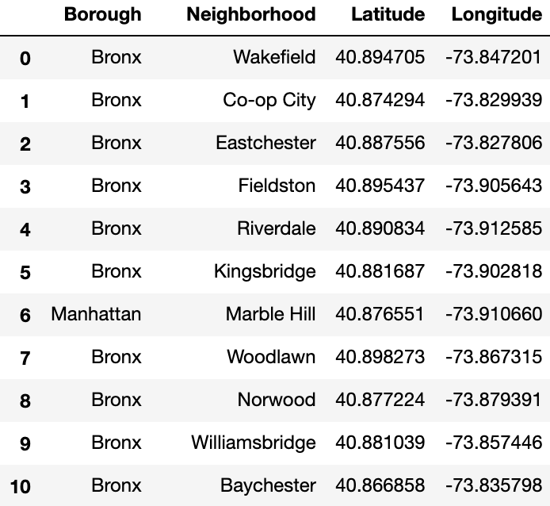

As the foursquare api could only retrieve details of restaurants based on the radius from the centre of a specified latitude and longitude, I was unable to retrieve all chinese restaurants by neighborhood. Moreover, due to limitations in the number of calls I could do as I was a non-premium member, I limited the radius from the center of the neighborhood to 2km. Thus, only chinese restaurants which are within a 2km radius from the center of the neighborhood would be retrieved from the foursquare api.

See below for the resulting dataframe, which I have named chinese_restaurant_df:

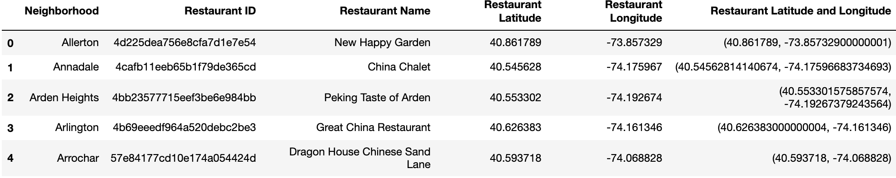

After exploring chinese_restaurant_df, I noticed that there was a discrepancy in the number of unique neighborhoods (300) as opposed to the number of unique chinese restaurants by coordinates (270). Moreover, while the number of unique chinese restaurants by name is 255, the unique count by restaurant ID is 270. Thus, it is likely that some chinese restaurants have the same name, yet are not referring to the same restaurants since they have different IDs and are located in different places.

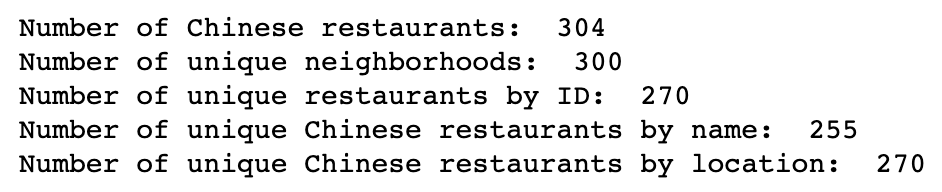

Now, I will create a new unique_chinese_restaurant_df by removing the duplicated restaurants by ID. The number of duplicated restaurants removed is 34, resulting in only 270 chinese restaurants in the dataframe.

Since the remaining dataframe consists only of unique chinese restaurants, I will now continue to gather more data about each of these restaurants to prepare for training. Using the foursquare api's [venues method](https://developer.foursquare.com/docs/api-reference/venues/details) I will retrieve the 'Likes', 'Ratings', and 'Price Tier' of each chinese restaurant. Foursquare API defines 'Price Tier' as a value ranging from 1 (least pricey) - 4 (most pricey) for each venue.

The new dataframe now looks like the below:

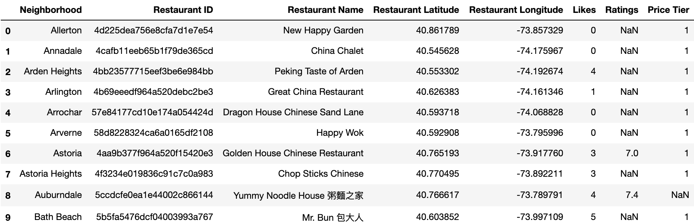

Exploring the dataframe, we get:

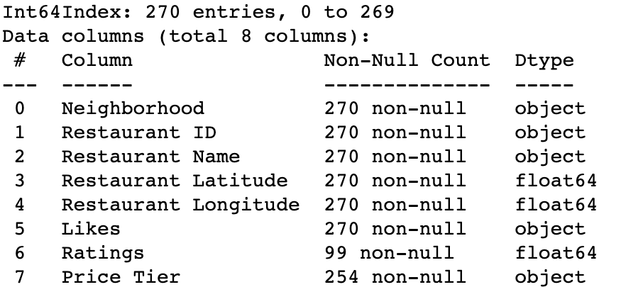

Notice that the column 'Ratings' has 99 non-null Count which means more than 60% of the values for the column is missing. Thus, I will be dropping the entire column before feeding it for training as it would not provide much information.

Next, I will normalize the values of 'Likes', 'Ratings', and 'Price Tier' to plot a bar graph so as to visualize the top 10 most popular chinese restaurants by 'Likes'.

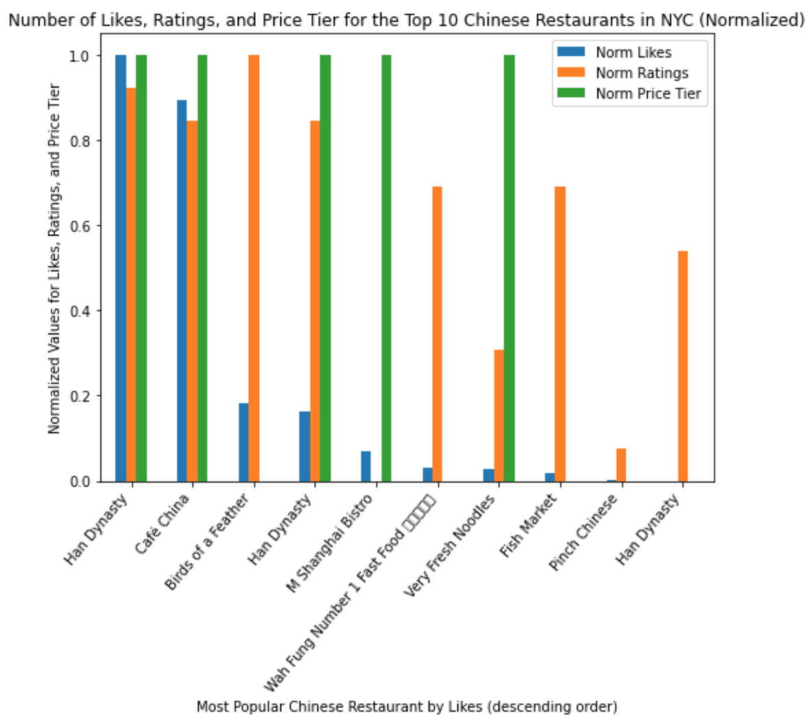

As seen earlier, there are numerous null values in the 'Price Tier' column as well. To see if I will be able to find a relationship between 'Likes' and 'Price Tier', and thus fill the missing values with a prediction, I will make a scatter plot between the two columns. See below for the plot:

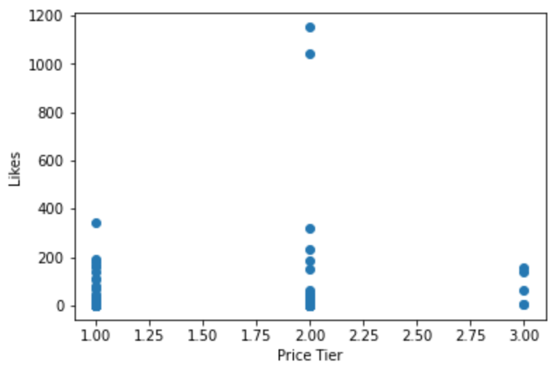

As seen from the above, there is no clear relationship between the two columns. Moreover, since I am only seeking to predict a restaurant's popularity based on locaton, the 'Price Tier' variable should not be part of the feature set. Thus, I will drop the 'Price Tier' column.

Now, I will have to retrieve all the nearby venues for each chinese restaurant and onehot encode them so that I will be able to fit the data into various Machine Learning models. To retrieve venues that are within 1km of each chinese restaurant, I will be using the [explore method](https://developer.foursquare.com/docs/api-reference/venues/explore/).

The resulting dataframe is as follows:

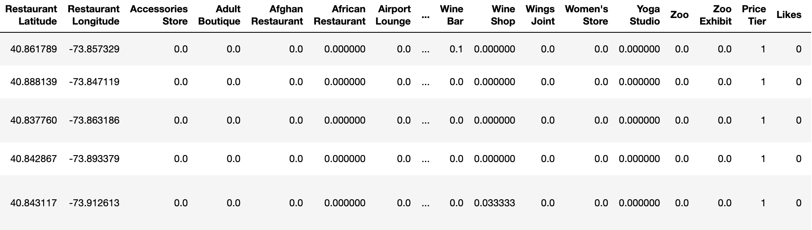

Since I will be training the models to classify them into 3 categories - Popular, Average, Unpopular - I have decided to take the top 25 percentile most liked restaurant and labeled them as 'Popular', while the bottom 25 percentile liked restaurants are labeled as 'Unpopular'. The remaining restaurants have been labeled 'Average' under the 'Popularity' column.

See the below dataframe:

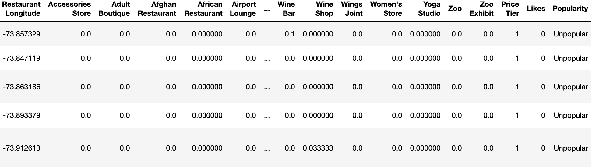

### 2.3 Feature Selection

After data cleaning, there were 264 samples and 372 features in the data. These features included the existence of Airport Service,  American Restaurant, Animal Shelter, etc. that are in the viscinity of the Chinese restaurant. Upon examining the meaning of each feature, it was clear that there was some redundancy in the features. For example, features like 'Restaurant ID' and 'Restaurant Name' would no affect the variable that we are testing - location. Moreover, the mere values of a venue's latitude and longitude are unlikely to impact the prediction of the popularity of a venue. What should be kept would be the onehot encoding of the existence of various categories in the viscinity of the restaurant.

'Popularity' has also been removed as it would make up the outcome vector rather than the feature vector.

Hence, from the onehot encoded dataframe, I removed the columns 'Neighborhood', 'Restaurant ID', 'Restaurant Name', 'Restaurant Latitude', 'Restaurant Longitude', 'Popularity', 'Price Tier', 'Likes', keeping only the existence of a venue in the viscinity of the chinese restaurant. See below.

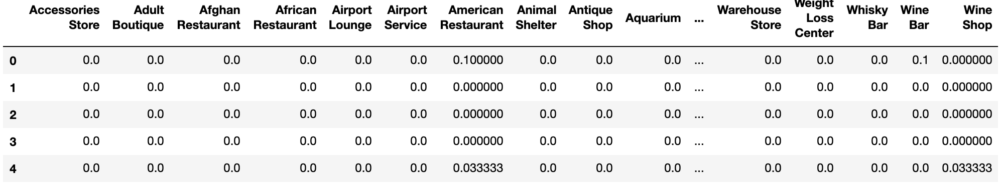

The column 'Popularity' was assigned to the outcome vector variable y.

## 3. Predictive Modeling

Since I know that there are 3 categories of popularity - 'Popular', 'Average', 'Unpopular' - that I am trying to train the model to predict and it I have the number of 'Likes', which is used as the metric for popularity, I will be using a supervised learning model. In this case, I have chosen to use classification type. After selecting the features in [Feature Selection](#23-feature-selection), I used the method [train_test_split](https://scikit-learn.org/stable/modules/generated/sklearn.model_selection.train_test_split.html) in the scikit-learn package to split the dataset leaving behind 80% for training and 20% for testing.

In the next few sections, I will be exploring the use of K Nearest Neighbors, Decision Tree, Support Vector Machine, and Logistic Regression to determine which will give the highest accuracy and, thus use it to predict the popularity of each venue.

## 3.1 Classification Models

Now, for each model, I will be using plotting a graph of accuracy against a hyperparameter. This is to determine what value of the hyperparameter will yield the best results. After which, I will use these best hyperparameters for each model and compare them with one another in [Model Evaluation](#32-model-evaluation) to determine which model is the best for predicting popularity of each venue.

### 3.1.1 K Nearest Neighbors (KNN)

Using the [scikit-learn KNN module](https://scikit-learn.org/stable/modules/generated/sklearn.neighbors.KNeighborsClassifier.html), I will be tuning for the number of neighbors parameter, starting with the value 1 till 30. See below for the plot between Accuracy and Number of Neighbors.

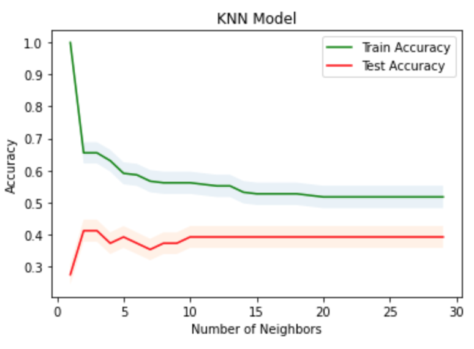

Looking at the graph, it is clear that the best K value for KNN in this case is 2 with 41% accuracy.

Additionally, realise that

### 3.1.2 Decision Tree

Using the [scikit-learn Decision Tree module](https://scikit-learn.org/stable/modules/generated/sklearn.tree.DecisionTreeClassifier.html), I will be tuning for the value of tree's depth, starting with the value 1 till 20. See below for the plot between Accuracy and Decision Tree depth.

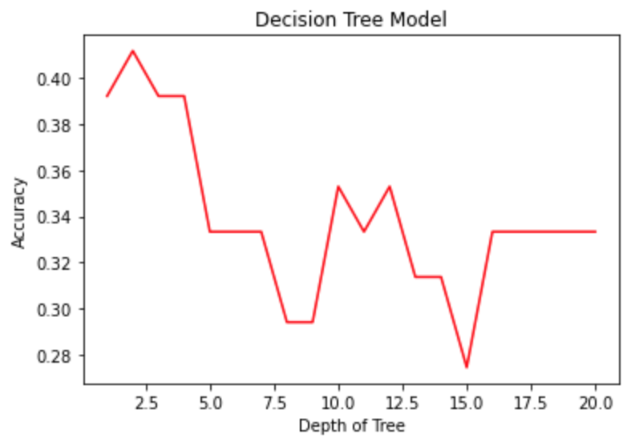

Notice that the tree depth that yields the best accuracy score in this case is 2. See below for the Decision Tree visualization:

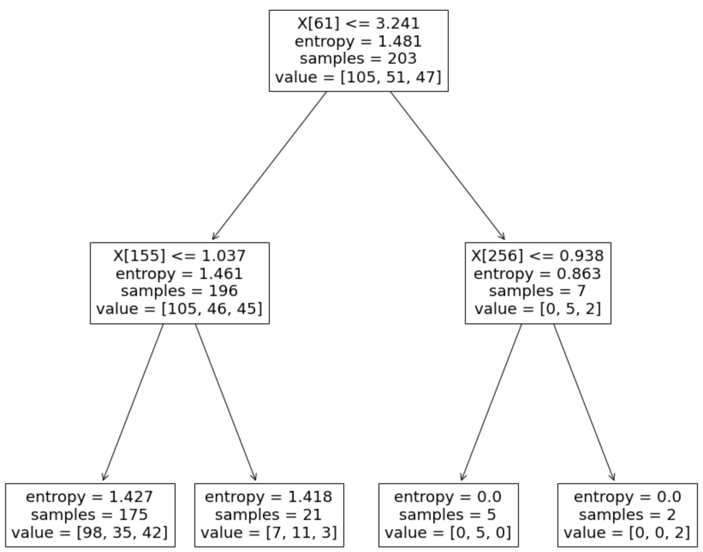

At the tree depth of 2, it is evident from the graph that the test accuracy is approximately 42%.

### 3.1.3 Support Vector Machine (SVM)

For SVM, I used the [scikit-learn SVM module](https://scikit-learn.org/stable/modules/generated/sklearn.svm.SVC.html). Then, I tuned the C value from 0.1 to 1.0. C value in this case refers to the regularization parameter as seen in the [docs](https://scikit-learn.org/stable/modules/generated/sklearn.svm.SVC.html). The strength of the regularization is inversely proportional to C. Refer to the graph below for the accuracy against C Value plot.

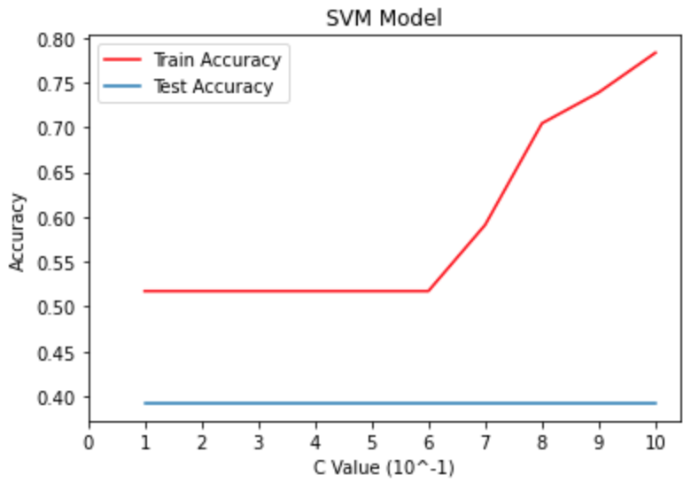

Since there isn't any noticeable difference in the accuracy of the test set based on the change in C value, I will be setting C value to 0.1 when comparing with the other models. At this value, the model has a train accuracy of 52% and test accuracy of about 38%.

### 3.1.4 Logistic Regression

For Logistic Regression model, I used the [scikit-learn LogisticRegression module](https://scikit-learn.org/stable/modules/generated/sklearn.linear_model.LogisticRegression.html) with the solver parameter set to saga as it is a multiclass problem. I also varied the C Value, which is the inverse of regularization strength, to determine the value that gives the highest test accuracy. Refer to the graph below:

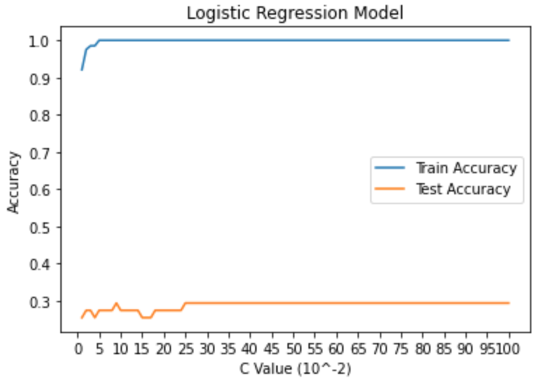

Evidently, the best C value in this case is 0.09 with an accuracy of approximately 30% for test set and 100% for train set.

## 3.2 Model Evaluation

Now that we have completed hyperparameter tuning for each of the classification models, using the best parameter values for each model, I will test for the best model.

The metrics that I will be using for each model are:

* [Jaccard Similarity Score](https://scikit-learn.org/stable/modules/generated/sklearn.metrics.jaccard_score.html)
* [F1-Score](https://en.wikipedia.org/wiki/F1_score)
* [Log Loss](http://wiki.fast.ai/index.php/Log_Loss#:~:text=Learning%20Course%20Wiki-,Log%20Loss,a%20log%20loss%20of%200.)

See below for the scores calculated for each classifier:

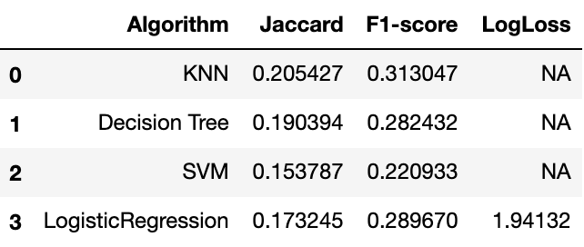

Looking at the above metric score table, it is clear that KNN model surpasses the others. Note however that the scores aren't high at all. This is likely due to a lack of dataset which will be explained in [Conclusion](#4-conclusion) and proposal to solutions is in [Future Work](#5-future-work).

Now, refer to [Model Application](#33-model-application) to see the results!

## 3.3 Model Application

In this section, I will be applying KNN, as previously determined in [Model Evaluation](#32-model-evaluation) that it yields the best scores, to predict the potential popularity of each venue in New York if used as a Chinese restaurant. [Section 3.3.1 Data for finding best locations](#331-data-for-finding-best-locations) details the steps taken to preparing the data such that the KNN model can predict the likelihood of a venue's success as a Chinese restaurant based on its location. [Section 3.3.2 Visualizing Results](#332-visualizing-results) portrays the map of New York with the best and worst spots superimposed on top.

### 3.3.1 Data for finding best locations

To predict which are the best venues business owners who are interested in setting up a Chinese restaurant in New York, I will be retrieving all kinds of venues regardless of whether it was previously a restaurant. This is to help business owners that are solely interested in a good starting location rather than being concerned about the huge initial capital outlay in restructuring the venue. See [Future Work](#5-future-work) for further explanation.

Using the Foursquare API, I retrieved all venues in New York along with their respective coordinates. This resulted in a dataframe of 240 venues as seen below:

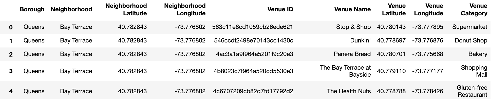

Using the above dataframe, I used the Foursquare API's [explore method](https://developer.foursquare.com/docs/api-reference/venues/explore/) to retrieve the nearby venues for each venue. After which, I onehot encoded each venue category for each venue and grouped them together. The resulting dataframe is shown below:

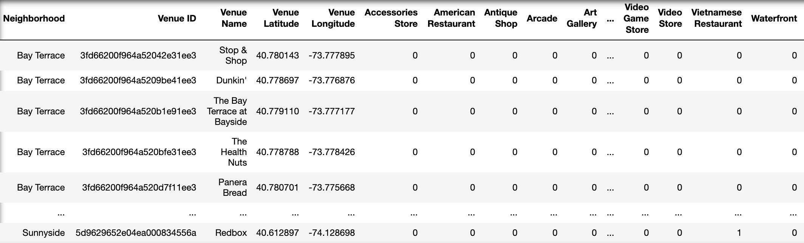

Below shows the describe method output for the above dataframe:

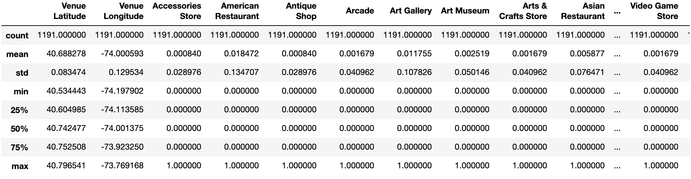

Notice that the resulting one hot encoded dataframe only has 242 columns for the existence of various categories of venues, such as 'Accessories Store' and 'American Restaurant', as opposed to the original feature set that was used to train the classifiers, which had 364 columns.

This shows that not all venues that were scraped by the Foursquare API existed in the dataframe that was used to train the models earlier on in [2.3 Feature Selection](#23-feature-selection). Thus, I dropped all new columns in the current dataframe that I am attempting to predict the popularity of so as to match the trained model. I also had to append columns that were missing from the current dataframe but was used to train the model so as to match the input dataframe to the feature set.

The resulting dataframe is shown below:

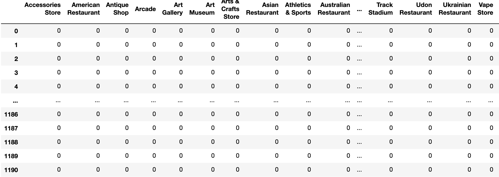

It has 1191 rows of venues and for each venue there were 364 columns. This matched the shape used in [Feature Selection](#23-feature-selection), thus I am confident of moving forward with prediction in [3.3.2 Visualizing Results](#332-visualizing-results)

### 3.3.2 Visualizing Results

After inputting the data gathered in [3.3.1 Data for finding best locations](#331-data-for-finding-best-locations) into the KNN model, I retrieved the following dataframe:

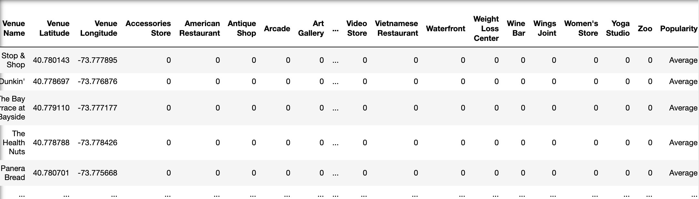

Then, I used folium to plot a map of New York, superimposing the venues that have been labeled 'Popular' as blue circular markers and 'Unpopular' as red circular markers. Looking at the map below, interested stakeholders should avoid the venues marked red while the blue venues are those they could potentially consider as they are likely to be a good location for setting up a Chinese restaurant.

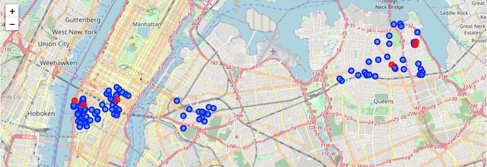

## 4. Conclusion

Notice from the map above that for each neighborhood, there are both great locations and poor locations to setup a Chinese Restaurant. That said, the accuracy of predicting a location's popularity based on its nearby locations seems to be an arduous and inaccurate task as shown from the low accuracies above. The low accuracy could be due to a lack of dataset and limitations of the Foursquare API in getting a precise value of 'Likes' for each restaurant.

I would also have to admit that simply taking the top 25 percent most 'Likes' from the Chinese Restaurant dataframe and setting it as 'Popular' for the outcome vector, y is not going to be a good gauge on whether a Chinese Restaurant is popular.

One such reason is that different restaurants would attract different demographics of people. This means that some restaurants would be more catered towards younger, more tech-savvy customers which may be more inclined to 'Like' a chinese restaurant on social media. Moreover, there are other factors like a restaurant's intentional efforts to boosting its likes by giving freebies to customers who 'Like' the restaurant on social media. Other factors that could've affected a restaurant's 'Likes' count, rendering the 'Likes' metric for popularity to be inaccurate, could be the duration for which the restaurant have existed. For instance, a restaurant which may have started 2 years ago would definitely have more likes than a newly setup restaurant. This does not necessarily mean that the location of the new restaurant is bad and hence it has lesser likes as it would take time for people to notice its existence and to gain popularity.

Thus, based on these reasons, while a restaurant's 'Likes' count may be high, it does not necessarily mean that they are popular.

## 5. Future Work

To address the factor that different restaurants attract different demographics of people, one logical approach to reducing this inaccuracy could be training the model on similar restaurants in terms of appeal to the kind of demographics. For example, comparing a Chinese Si Chuan Delicacy Restaurant in Bay Terrace neighborhood with another Chinese Si Chuan Delicacy Restaurant in Sunnyside neighborhood. This would reduce the other variables in the training set, narrowing the effects of a change in popularity such that it is only due to a restaurant's location.

Addressing the factor that a restaurant may have began earlier would be as simple as retrieving a restaurant's start date and only feeding Chinese Restaurants with similar start dates to train the classification model. However, doing so may lead to insufficient dataset. Instead, I would recommend to use 'Likes' from restaurants that are fairly new (perhaps within a year old - more experiments need to be done) as doing so would limit other variables such as consumers growing a preference for the restaurant and hence coming back often rather than due to its location, which is what we are trying to predict here. Thus, limiting the 'Likes' such that we are only retrieving the starting phase of a restaurant would mean that most customers are only going there because of its location as they do not yet know whether the restaurant's quality of food appeals to their personal preferences.

Another thing to consider would be that thelocations taken for predicting in [3.3.1 Data for finding best locations](#331-data-for-finding-best-locations) did not consider the size of the venue due to limitations of the foursquare api. This would certainly make some venues invalidated as their physical limitations would make it unsuitable for setting up a Chinese restaurant.

Lastly, venues taken for prediction also did not consider the huge initial capital outlay in reconstructing venues that do not already have the equipments needed in a restaurant like stoves, exhaust filter, etc. Should a stakeholder that is interested in finding out only popular spots that were previously restaurants and thus, reduce the cost of the initial startup, the party can input only existing restaurants into the KNN model for prediction.

## References
* [Migration Policy Stats](https://www.migrationpolicy.org/article/chinese-immigrants-united-states)
* [New York Neighborhoods](https://ibm.box.com/shared/static/fbpwbovar7lf8p5sgddm06cgipa2rxpe.json)
* [Foursquare API](https://developer.foursquare.com/docs/places-api/)

